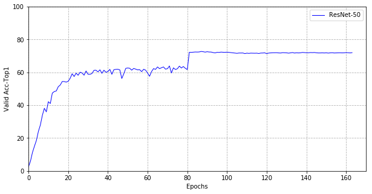

# Cifar100-PyTorch
Classification on CIFAR-100 with PyTorch.

## Prerequisites
Please see the [tutorials/cifar100_tutorials.ipynb](tutorials/cifar100_tutorials.ipynb) to organize the CIFAR-100 train dataset and test dataset.

## Usage
### Training 
```shell
sh train_cifar100.sh resnet-110 0
```

### Evaluation
```shell
python evaluate.py --checkpoint-path experiments/resnet-110/checkpoint_best.pth --gpu 0
```

## Results
|                      Model                     |      Params    |     GFlops     |    Acc Top1   |    Acc Top5    |
| ---------------------------------------------- | -------------- | -------------- | ------------- | -------------- |
| resnet-110(BasicBlock)                         |      1.74 M    |      0.26      |    69.140 %   |    90.880 %    |
| resnet-110(BasicBlock, Label Smooth)           |      1.74 M    |      0.26      |    70.410 %   |    89.810 %    |
| resnet-110(Bottleneck)                         |      1.17 M    |      0.17      |    72.560 %   |    92.340 %    |
| resnet-110(Bottleneck, Label Smooth)           |      1.17 M    |      0.17      |    71.370 %   |    90.810 %    |
| resnet-110(Bottleneck, Warmup Step 5)          |      1.17 M    |      0.17      |    72.250 %   |    92.430 %    |
| resnet-110(Bottleneck, cosine_lr)              |      1.17 M    |      0.17      |    71.370 %   |    91.480 %    |

<div align="left">
  
</div>